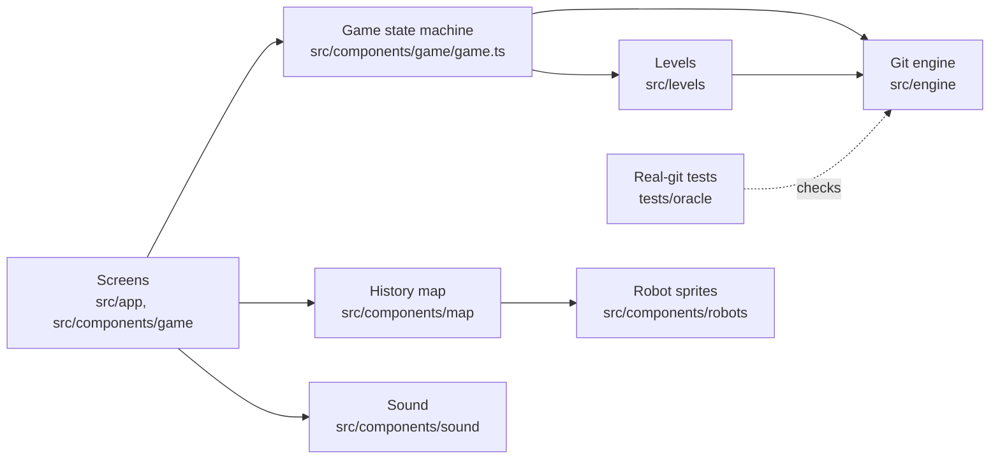

# Architecture

Merge Crew is a static Next.js app. Everything runs in the browser: there is no server code, database or account system. The game is built from five parts that depend on each other in one direction only.

## The git engine (`src/engine`)

A git simulator written as pure TypeScript functions, with no React and no browser or Node APIs.

- **The whole repository is one plain object.** `RepoState` in `types.ts` holds the repository: commits, branches, reflogs, remotes, the stash, and one worktree per actor. The player owns the main worktree, and each robot works in its own linked worktree, the way parallel coding agents do.
- **`engine.run(state, { actor, argv })` runs one command.** It returns a new state, the terminal output and a list of events. It never changes the old state and never throws for a user mistake.
- **A refused command changes nothing.** Where real git would leave partial changes behind, the engine leaves none. A command that stops on a conflict counts as a success, because the state did change. The known differences from git are listed in `docs/decisions.md`.
- **Events are the only link to the visuals.** Examples: "commit created", "branch moved", "commits lost". The map, the robots and the sounds all read the same list.
- **Code layout:** one file per command family in `commands/`. Revision parsing (`HEAD~2`, `main@{1}`, `origin/main`) is in `revisions.ts`. The line diff and the three-way merge are ports of git's own algorithms, in `diff.ts` and `merge3.ts`. Rebase, cherry-pick and revert share a sequencer in `sequencer.ts`.
- **Read-only questions live in `queries` (`query.ts`).** Which commits are reachable, which are lost, what `git status` would say. Goals, hints and views use these.

## Tests against real git (`tests/oracle`)

Writing a git simulator is easy to get subtly wrong, so real git is the referee.

- **Each scenario runs twice.** Once with the real `git` command line in a temporary folder (with a bare `origin` and linked worktrees), and once through the engine.
- **Both runs become comparable snapshots.** The real side and the engine generate different commit ids, so commits are identified by their message. A snapshot holds branches, remote branches, each commit's parents and files, each worktree's HEAD, staged files, working files, conflicts and reflog, and the stash.
- **Every difference fails the test,** and so does a step that succeeds on one side and fails on the other.

There are 122 scenarios, covering commits, branches, reset, merges with conflicts, remotes and force-push, worktrees, rebase, cherry-pick, revert and stash. Git's settings are pinned so the results are the same on every machine. `tests/oracle/levels.test.ts` also plays every level's setup, scene and documented solution in real git and compares the result.

## Levels (`src/levels`)

A level is data, not code paths in the UI:

- `setup`: git commands and file edits that build the starting repository from empty, instantly.
- `intro` and `outro`: scripted scenes. Robots run git commands, speak and change mood.
- `goals`: checks on the resulting state, written with the helpers in `goals.ts`. Goals accept any fair solution and reject shortcuts that lose work or rewrite shared history.
- `hintContext` and `suggestions`: support for the player.
- `brief` and `mission`: the level list's one-liner, and the brief card's plain-words mission (what's going on, your job, what you'll practise).

A `say` step may name the working files it talks about (`files`). The files panel highlights them while the line shows, and the line offers them as chips that open the file. The player's current task is always shown in the "Your job" bar above the terminal: the first goal not yet met.

A `point` step is a guided-tour line: the robot says it like a `say` line, and while it shows the screen dims softly around the region it names (`map`, `jobbar`, `terminal`, `suggestions`, `goals`, `files`) and outlines it in the robot's colour (`TourSpotlight.tsx`; each region marks itself with a `data-tour` attribute). A map `focus` also lights up commits by message, branch lines by name, or the lost band, inside the map (`map/focus.ts`, `map/MapFocus.tsx`). The "?" button in the level header replays the first level's point steps over the player turn as a standalone tour; it lives in the level reducer (`LevelModel.tour`) and never touches the game state.

Every level has a documented solution, kept in a test-only `*.solution.ts` file so it never reaches the browser. The tests run setup, intro and solution through the engine and require a win. They also check that wrong approaches fail.

## Game state machine (`src/components/game/game.ts`)

Plain functions move a level through its phases: `brief → intro → play → outro → won`. They play scenes step by step, run the player's commands as actor `player`, apply file edits from the conflict editor and re-check goals. `useLevel.ts` is the thin React layer that adds timing: it waits for clicks and for the map's animations. The logic has no React in it, so it is tested directly, and every level is played to the win in the tests.

## History map (`src/components/map`)

The map draws history like a metro map in four steps:

1. **`layout.ts` places commits on a grid.** main runs straight, each branch gets its own line, and lost commits drop to a separate band.
2. **`geometry.ts` turns the grid into pixels.**
3. **`timeline.ts` decides what animates when.** It turns a list of engine events into a schedule.
4. **`HistoryMap.tsx` draws the SVG and plays the schedule** with motion. It is split into layers: `MapEdges`, `MapStops`, `MapTags` and `MapHeads`.

Steps 1 to 3 are pure and unit tested, as are the helpers for tags (`tags.ts`), robot placement (`placement.ts`) and movement timing (`motion.ts`). The map asks the engine's `queries` which commits are reachable or lost, so the map and the goals always agree. Next to the drawing, a list of commits is kept for screen readers. A development-only viewer for map scenes is at `/dev/map`.

## Shared helpers (`src/lib`)

- `palette.ts`: every colour in the game, defined once. The root layout writes the colours as CSS variables, Tailwind maps them to classes such as `bg-ink` and `text-muted`, and the SVG map reads the same constants. A test checks the contrast of every text and background pair.
- `storage.ts`: browser storage with an in-memory fallback, used for level progress and the mute setting.

## Robots and sound

- **Robot sprites (`src/components/robots`):** the art lives in `public/assets/pocket-machines` (CC0, see `ASSETS.md`). `scripts/build-sprites.mjs` turns the source PNG sheets into small WebP sheets and a typed manifest. `Sprite.tsx` plays a sheet with CSS steps, so no JavaScript runs per frame.
- **Sound (`src/components/sound`):** synthesized in the browser with the Web Audio API, with no audio files. Robots speak in short, deterministic gibberish blips, a different voice per robot and mood. Event sounds follow the same schedule the map animates. Nothing plays before the first interaction, and mute is remembered.

## Quality gates

Every pull request runs:
- lint, typecheck, all tests and a production build
- a secret scan (gitleaks)
- a check that blocks a private word list from code, commits and pull request text

`main` deploys to Vercel automatically.

## Working method

The project is built by parallel AI coding agents directed by the maintainer:
- `docs/spec.md` defines version 1.
- `src/engine/types.ts` is the contract between the parts.
- Each agent owns specific folders.
- `docs/decisions.md` records why things are the way they are.
- `docs/workflow-notes.md` records what was learned about working this way.
