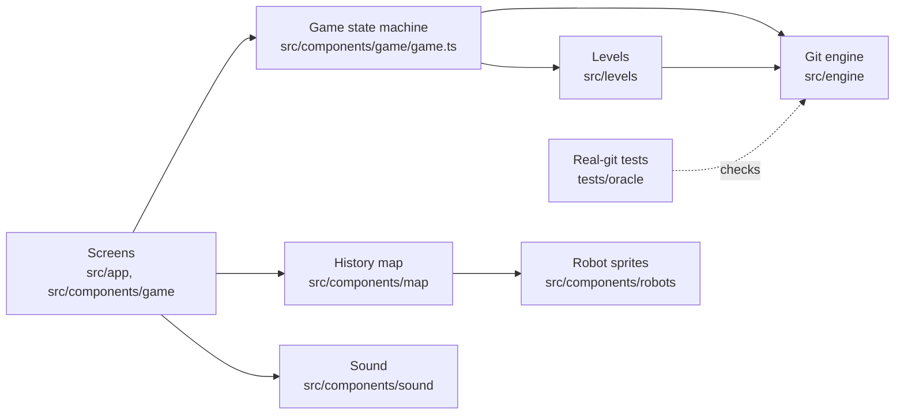

# Architecture

Merge Crew is a static Next.js app. The game runs in the browser: there is no database or account system, and the only server code is one route that asks a model for Tidy's hints (see "AI hints" below). The game is built from five parts that depend on each other in one direction only.

## The git engine (`src/engine`)

A git simulator written as pure TypeScript functions, with no React and no browser or Node APIs.

- **The whole repository is one plain object.** `RepoState` in `types.ts` holds the repository: commits, branches, reflogs, remotes, the stash, and one worktree per actor. The player owns the main worktree, and each robot works in its own linked worktree, the way parallel coding agents do.
- **`engine.run(state, { actor, argv })` runs one command.** It returns a new state, the terminal output and a list of events. It never changes the old state and never throws for a user mistake.
- **A refused command changes nothing.** Where real git would leave partial changes behind, the engine leaves none. A command that stops on a conflict counts as a success, because the state did change. The known differences from git are listed in `docs/decisions.md`.
- **Events are the only link to the visuals.** Examples: "commit created", "branch moved", "commits lost". The map, the robots and the sounds all read the same list.
- **Code layout:** one file per command family in `commands/`. Revision parsing (`HEAD~2`, `main@{1}`, `origin/main`) is in `revisions.ts`. The line diff and the three-way merge are ports of git's own algorithms, in `diff.ts` and `merge3.ts`. Rebase, cherry-pick and revert share a sequencer in `sequencer.ts`.
- **Read-only questions live in `queries` (`query.ts`).** Which commits are reachable, which are lost, what `git status` would say. Goals, hints and views use these.

## Tests against real git (`tests/oracle`)

Writing a git simulator is easy to get subtly wrong, so real git is the referee.

- **Each scenario runs twice.** Once with the real `git` command line in a temporary folder (with a bare `origin` and linked worktrees), and once through the engine.
- **Both runs become comparable snapshots.** The real side and the engine generate different commit ids, so commits are identified by their message. A snapshot holds branches, remote branches, each commit's parents and files, each worktree's HEAD, staged files, working files, conflicts and reflog, and the stash.
- **Every difference fails the test,** and so does a step that succeeds on one side and fails on the other.

There are 122 scenarios, covering commits, branches, reset, merges with conflicts, remotes and force-push, worktrees, rebase, cherry-pick, revert and stash. Git's settings are pinned so the results are the same on every machine. `tests/oracle/levels.test.ts` also plays every level's setup, scene and documented solution in real git and compares the result.

## Levels (`src/levels`)

A level is data, not code paths in the UI:

- `setup`: git commands and file edits that build the starting repository from empty, instantly.
- `intro` and `outro`: scripted scenes. Robots run git commands, speak and change mood.
- `goals`: checks on the resulting state, written with the helpers in `goals.ts`. Goals accept any fair solution and reject shortcuts that lose work or rewrite shared history.
- `suggestions`: the commands the suggestion buttons fill in. What Tidy's hint helper knows about a level is not in the level file: it lives server-side in `src/hints/data` (see "AI hints").
- `brief` and `mission`: the level list's one-liner, and the brief card's plain-words mission (what's going on, your job, what you'll practise).

A `say` step may name the working files it talks about (`files`). The files panel highlights them while the line shows, and the line offers them as chips that open the file. The player's current task is always shown in the "Your job" bar above the terminal: the first goal not yet met.

A `point` step is a guided-tour line: the robot says it like a `say` line, and while it shows the screen dims softly around the region it names (`map`, `jobbar`, `terminal`, `suggestions`, `goals`, `files`) and outlines it in the robot's colour (`TourSpotlight.tsx`; each region marks itself with a `data-tour` attribute). A map `focus` also lights up commits by message, branch lines by name, or the lost band, inside the map (`map/focus.ts`, `map/MapFocus.tsx`). The "?" button in the level header replays the first level's point steps over the player turn as a standalone tour; it lives in the level reducer (`LevelModel.tour`) and never touches the game state.

Every level has a documented solution, kept in a test-only `*.solution.ts` file so it never reaches the browser. The tests run setup, intro and solution through the engine and require a win. They also check that wrong approaches fail.

## Game state machine (`src/components/game/game.ts`)

Plain functions move a level through its phases: `brief → intro → play → outro → won`. They play scenes step by step, run the player's commands as actor `player`, apply file edits from the conflict editor and re-check goals. `useLevel.ts` is the thin React layer that adds timing: it waits for clicks and for the map's animations. The logic has no React in it, so it is tested directly, and every level is played to the win in the tests.

## History map (`src/components/map`)

The map draws history like a metro map in four steps:

1. **`layout.ts` places commits on a grid.** main runs straight, each branch gets its own line, and lost commits drop to a separate band.
2. **`geometry.ts` turns the grid into pixels.**
3. **`timeline.ts` decides what animates when.** It turns a list of engine events into a schedule.
4. **`HistoryMap.tsx` draws the SVG and plays the schedule** with motion. It is split into layers: `MapEdges`, `MapStops`, `MapTags` and `MapHeads`.

Steps 1 to 3 are pure and unit tested, as are the helpers for tags (`tags.ts`), robot placement (`placement.ts`) and movement timing (`motion.ts`). The map asks the engine's `queries` which commits are reachable or lost, so the map and the goals always agree. Next to the drawing, a list of commits is kept for screen readers. A development-only viewer for map scenes is at `/dev/map`.

## Shared helpers (`src/lib`)

- `palette.ts`: every colour in the game, defined once. The root layout writes the colours as CSS variables, Tailwind maps them to classes such as `bg-ink` and `text-muted`, and the SVG map reads the same constants. A test checks the contrast of every text and background pair.
- `storage.ts`: browser storage with an in-memory fallback, used for level progress and the mute setting.

## Robots and sound

- **Robot sprites (`src/components/robots`):** the art lives in `public/assets/pocket-machines` (CC0, see `ASSETS.md`). `scripts/build-sprites.mjs` turns the source PNG sheets into small WebP sheets and a typed manifest. `Sprite.tsx` plays a sheet with CSS steps, so no JavaScript runs per frame.
- **Sound (`src/components/sound`):** synthesized in the browser with the Web Audio API, with no audio files. Robots speak in short, deterministic gibberish blips, a different voice per robot and mood. Event sounds follow the same schedule the map animates. Nothing plays before the first interaction, and mute is remembered.

## AI hints (`src/hints`, `src/app/api/hint`)

The player can ask Tidy for a hint with the "Ask Tidy" button next to the job bar. A hint is one or two short sentences in Tidy's voice that point toward the next idea and never contain the answer.

**Flow.**

1. The button (`AskTidyButton.tsx`) dispatches `hint-ask` in the level reducer: Tidy shows "thinking" in the dialogue strip below the command box, and the run's hint counter goes up (5 per run; restart starts a new run).
2. `hintRequest.ts` builds the request from what the player can already see: the level id, the hint number, the last 8 player commands with the first lines of their output and whether git accepted them, which goals are met, a short status summary, and `previousHints`: the hint texts Tidy already showed in this run, oldest first (at most 4, each at most 260 characters; the level reducer keeps them in `LevelModel.hintsShown`, leaving out refunded offline lines, and a restart clears them). It POSTs it to `/api/hint`.
3. The route (`src/app/api/hint/route.ts`) rejects cross-site requests, non-JSON, bodies over 8 KB (previous hints included) and anything that does not match the request shape exactly (`validate.ts`; `previousHints` is optional, and when present must be a list of non-empty strings, no longer than the hints that can have come before this one), then applies the rate limits.
4. `server.ts` decides whether the model may be asked (`HINTS_AI=off` and missing credentials both say no), builds the prompt (`prompt.ts`) from the level's server-side context, the goals with the current one marked, what the player tried and the previous hints (marked as data; the model is told not to repeat or reword them and to go one step further), and calls a model through the Vercel AI Gateway with a plain model string, chosen by hint number (`modelForHint`):
   - Hints 1 and 2 use `HINT_MODEL`, `google/gemini-2.5-flash-lite`. It was chosen with `npm run eval:hints` over Claude Haiku 4.5, which gave the answer away more often.
   - Hint 3 and later (`LAST_HINT_FROM`, the first hint allowed to name a command) use `LAST_HINT_MODEL`, `google/gemini-2.5-flash`. Flash-Lite often missed the right command for the player's situation at this rung. Against Flash-Lite, Claude Haiku 4.5 and Claude Sonnet 5 on the same cases, Flash named the case's expected command clearly more often than Flash-Lite with no leaks, close to Haiku at about a third of its cost and faster; the numbers are next to the constant.
   - If a hint's model fails, the Gateway tries `FALLBACK_MODELS` (Claude Haiku 4.5), never the hint's own model (`fallbackModelsFor`; a model that is itself the only fallback gets the other hint model instead).
   - Gemini thinking is off (`thinkingBudget: 0`): it would spend the output budget before the hint, and Gemini 2.5 Flash returned cut-off fragments with it on.

   The model that actually answered is read from the Gateway's routing metadata, because the AI SDK reports the requested model even after a fallback; it goes into the trace metadata as `model`. At most 120 output tokens, temperature 0.2, no SDK retries, 6 second timeout.
5. The answer is vetted (`leak.ts`). If anything is off, the response is the level's next scripted hint instead. The response says which: `{ text, source: "ai" | "scripted", reason? }`.
6. The hint appears in the dialogue strip as Tidy speaking, with Tidy's voice. The command box stays active the whole time: the player keeps typing, and Esc or a click puts the hint away. A failed or rate-limited request shows a gentle offline line and gives the hint back.

**The specificity ladder.** Each hint is one rung more specific than the last, all about the player's next step. Hint 1 names the idea behind that step, with no git command. Hint 2 narrows down where to look or what to compare, still with no command. Hint 3 and later name the git command to reach for, but nothing after it (no branch, commit, file or position from the solution). The instructions describe the whole ladder, and the prompt ends with the rule for this hint's number (`ladderRule`). Tidy speaks in the first person.

**Server-only data.** Each level's hint context (the situation and the intended fix) and its three scripted hints, gentle to specific and held to the same leak policy as model hints for their number, live in `src/hints/data/<level>.ts`. Every module there starts with `import "server-only"`, so a client import fails the build. The answer-leak check also needs the documented solutions (`src/levels/solutions.ts`); only server modules and tests import them. After `npm run build`, none of the context or solution text is in `.next/static`.

**Safety in code, not in the prompt.** The prompt asks the model not to give the answer away; `vetHint(raw, solution, hintNumber)` makes sure, with a policy per hint number (`leak.ts`). Quotes, backticks, case and whitespace are normalised first. A model hint is replaced by a scripted one when:

- it is empty, longer than 260 characters or more than two sentences (`empty`, `too-long`);
- it contains `--force` or `git push ... -f`, at any hint number (`leak-force`);
- it opens with the same sentence as a hint the player already got in this run, ignoring case and punctuation (`repeats-previous`);
- the model stopped at the output limit, so the answer ends mid-sentence (`cut-off`);
- hint 1 or 2 names any `git <subcommand>` from a known list, such as "Use git pull to…", "Try git push" or "run `git reflog`" (`leak-command`). Concept words ("look at the reflog", "a branch", "the stash") and plain sentences about git ("git keeps a diary") pass;
- hint 3 or later contains a solution command line that has arguments, or a `git <subcommand>` phrase that matches a solution step and names one of its arguments, such as `git branch x main@{1}` or `git revert HEAD~1` (`leak-solution`). The bare command (`git revert`, `git push`) is allowed.

The suggestion buttons do not make a command safe: a hint that says which button to press next still does the player's thinking. The fallback reasons are `disabled`, `no-credentials`, `model-error`, `timeout`, `empty`, `too-long`, `leak-command`, `leak-solution`, `leak-force`, `repeats-previous` and `cut-off`. Player text in the prompt is marked as data, and cannot open or close a prompt section.

**Limits and cost.** The client allows 5 hints per level per run. The route keeps a per-IP limit (20 per 10 minutes) and a per-instance limit (120 per minute) in memory. That is best effort only: serverless instances do not share memory, and a new instance starts with empty counters. The hard cap on spending is the AI Gateway budget the maintainer sets on the Vercel project; when it is used up, Gateway calls fail and players get the scripted hints.

**Tracing.** Follows Langfuse's setup for AI SDK 7 and its trace best practices. `src/instrumentation.ts` registers the Langfuse span processor and Langfuse's AI SDK integration (`@langfuse/vercel-ai-sdk`) only when `LANGFUSE_PUBLIC_KEY` and `LANGFUSE_SECRET_KEY` are set; without them nothing is registered or sent. One hint is one trace:

- `ask-tidy-hint` (root span): input is the goal the player is on, their recent commands and a status line; output is the hint they saw. Metadata holds the full request, `source`, the fallback `reason`, the model and, when the answer was rejected, the rejected text.
  - `generate-hint` (the AI SDK call) → `run-model-step` → `call-model` (a generation with model, prompt, output, token usage and cost).
  - `check-hint-safety` (a guardrail): the model's answer and whether the code check passed it.
- Trace attributes: the `hints` tag, `levelId` and `hintNumber` metadata, the browser's random `runId` as the session (the hints of one play of a level), and the environment (`development`, `preview` or `production`, from `VERCEL_ENV`, overridable with `LANGFUSE_TRACING_ENVIRONMENT`). No user id: players have no accounts, and IP addresses are never recorded.
- The AI SDK names its spans after the model; `StableSpanNames` in `src/hints/telemetry.ts` renames them so dashboards and evaluators keep working when the model changes. The processor's default filter exports only Langfuse and AI spans, so Next.js's own request spans are left out, and each hint starts from a clean root. Spans are sent immediately and flushed after the response.

**Evals (`evals/hints`).** `cases.ts` has 2 or 3 stuck moments per level: the player typed nothing useful, tried the wrong thing, or is one step from done. `materialise.ts` plays each case through the real game, so the request is exactly what the game would send.

- `cases.test.ts` runs with `npm test`, with no network: every case reaches a stuck player turn, builds a request the route accepts and a prompt with the right current goal, falls back to the scripted hint when a (mock) model leaks the answer, and returns the scripted hint without credentials. The leak check per hint number, length limits, fallback paths, rate limiter, request validation (including `previousHints`) and the prompt per hint number are unit tested in `src/hints/hints.test.ts`, the route in `route.test.ts`, and the client's tracking and sending of previous hints in `levelReducer.test.ts`.
- `npm run eval:hints` (`hints.eval.ts`, its own vitest config) plays each case's hint ladder the way a player would: it asks the real hint model for hints 1, 2 and 3 in order, each request carrying the hints shown before it as `previousHints`. It runs the deterministic checks on the raw answers (with the policy for that hint number), flags a shown hint that is word for word one shown earlier in the case (the summary lists any hint 3 identical to hint 1 or 2), and grades each with a rubric-based model grader (`grader.ts`, `openai/gpt-5-mini`): points toward the right next idea, does not give the answer, at most two sentences, Tidy's voice, and for hints 2 and 3 `moreSpecificThanPrevious` (adds something new and is one step more specific than the previous hints). The grader is told the hint number and the ladder (`LADDER_RULE`), so "does not give the answer" fails any git command in hints 1 and 2 but lets hint 3 name the command, failing only the solution's arguments or a full command line. Runs before 2026-10-06 judged a named command in hint 3 as giving the answer away, so their `noAnswer` and overall rates are not comparable with later runs. The summary reports shown source, fallback reasons, deterministic and grader pass rates overall and per hint number, and a `hint3` block: shown as AI vs scripted, leak rejections, how often the answer names a git command, how often it names the right one (deterministic: the case's `expectedCommand` in `cases.ts`, the subcommand of the documented solution's next step, or the way back to it after a wrong turn; cases where the next step is not one clear command have none), grader pass, average output tokens, the Gateway's cost per hint and latency. Results go to `evals/hints/results/` (ignored by git). Without credentials it skips and sends nothing. To compare models without editing code, set `HINT_EVAL_MODEL` (hints 1 and 2) or `HINT_EVAL_LAST_MODEL` (hint 3 on) to an AI Gateway model string; `HINT_EVAL_BATCH` sets how many cases run at once (default 4, the hints within a case always run in order), and `HINT_EVAL_BATCH=1` runs them one at a time on rate-limited plans.
- The grader is not calibrated. `labels.example.json` is the format for hints a person marks good or bad; with a `labels.json` in that format, the eval also grades each labelled hint and reports how often the grader agrees.

**Configuration.** Names only, in `.env.example`: `AI_GATEWAY_API_KEY` or `VERCEL_OIDC_TOKEN` (locally; on Vercel the project's OIDC token is used), `HINTS_AI` (`off` switches the model off), `LANGFUSE_PUBLIC_KEY`, `LANGFUSE_SECRET_KEY`, `LANGFUSE_BASE_URL`, `LANGFUSE_TRACING_ENVIRONMENT` (optional).

## Quality gates

Every pull request runs:
- lint, typecheck, all tests and a production build
- a secret scan (gitleaks)
- a check that blocks a private word list from code, commits and pull request text

`main` deploys to Vercel automatically.
